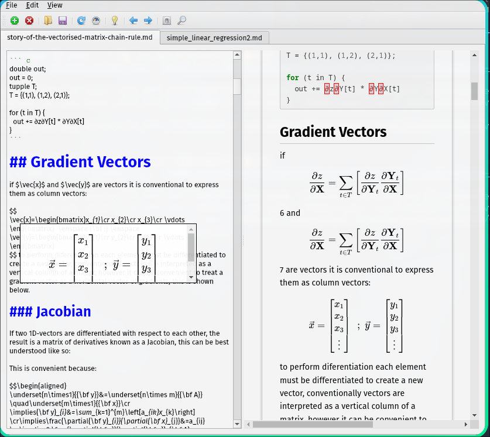
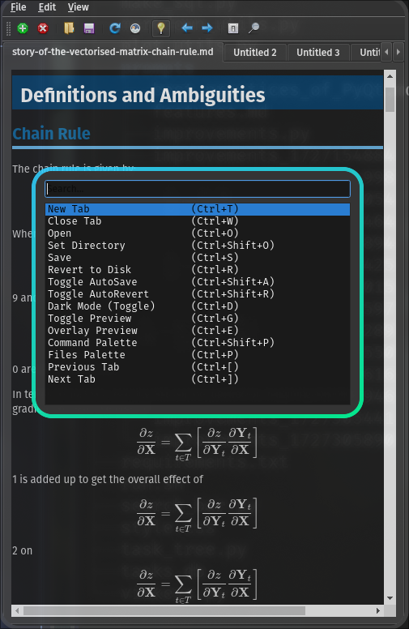

# Draftsmith

A markdown editor written with PyQt6.

The goal is to write something open source with a simple code base that can be used in place of Obsidian or VSCode. [^1] Motivated by Obsidian and a a love of Open Source software and a desire for inline math previews similar to [VNote](https://github.com/vnotex/vnote) or [Rstudio](https://github.com/rstudio/rstudio)

## Features

Draftsmith is a markdown editor with a focus on simplicity a native feel and good support for Mathematics:

- Custom CSS
- Popup previews for Math
- Palettes
  - Command Palette
  - File Palette
- Vim Bindings
  - Very basic at the moment, but I'm working on it.

<table>
<thead>
<tr class="header">
<th>Light</th>
<th>Dark</th>
</tr>
</thead>
<tbody>
<tr class="odd">
<td>



</td>
<td>



</td>
</tr>
</tbody>
</table>


[^1]: VSCode is great, but a popup preview for math would be nice. Obsidian is great, but it's not open source.

# Installation

In the future this will be packaged with Poetry and allow for install with `pipx`. For now, you can clone the repo:

```bash
cd $(mktemp -d)
git clone https://github.com/RyanGreenup/Draftsmith
cd Draftsmith
python3 -m venv venv
source venv/bin/activate
pip install -r requirements.txt
python main.py --css github-pandoc.css  /home/ryan/Notes/slipbox/index.md --dir ~/Notes/
```

